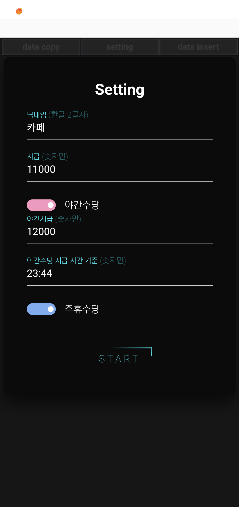

https://rbatimetomoney.netlify.app/

# 아르바이트 기록과 급여 계산 사이트

### 제작 배경
- 지인이 **네이버 캘린더**에 시간을 작성하고 매달 계산기로 계산한다고 해서 제작함.

### 주요 기능
1. **캘린더 연동**:
   - 캘린더에 아르바이트 시간을 기록.
2. **자동 급여 계산**:
   - 기록된 시간을 바탕으로 계산식을 적용해 **월급 합계 출력**.
     
## 화면

|  |  |  |
|------------------|-----------------|-----------------|

